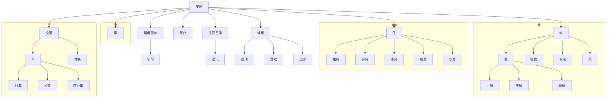
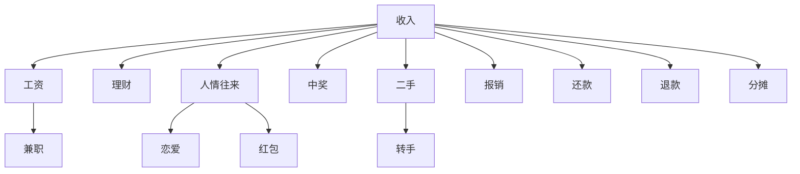
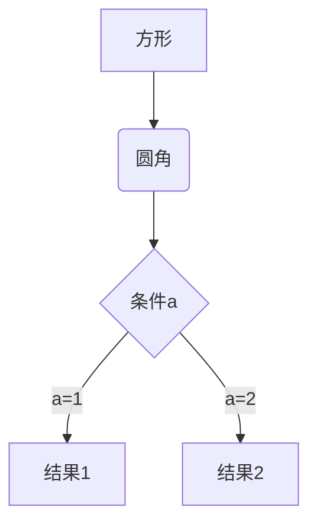
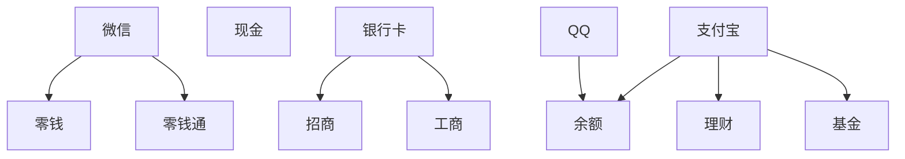

记账薄

 数据库

cashbook App 数据库

标签与类别：

标签可以同时拥有多个，比较虚，涉及各个方面：比如购物，但购物各个方面都可以涉及到

类别只有一个，且各类之间可能存在父子关系，

1、类别：TradeCategory （账单类别）

|   字段名|  类型  |  描述 |    默认值 |
| :---: | :---: |  ---- | ---- |
| categoryName | String | 类别名|  |
| createTime | Long | 创建时间|  |
| parentId | Long | 父类别| -1 |
| note | String | 备注|  |

支出，收入，内部转账    为 根类别

支出： 餐，零食，房租，电器，恋爱，转帐，水果

收入： 工资，理财，兼职

=====================================================================================

#### 详细的类别：衣，食，住，行；医疗，娱乐，通讯，人情往来，理财，丢失，增值服务

===============================================================================================

这期分类只分一层

2、标签TradeFlag（标签）

|   字段名|  类型  |  描述 |    默认值 |
| :---: | :---: |  ---- | ---- | ---- |
| name | String | 标签名|  |
| createTime | Long | 创建时间| 0 |
| note | String | 备注|  |

3、账户：TradeAccount

|   字段名|  类型  |  描述 |    默认值 |
| :---: | :---: |  ---- | ---- |
| accountName | String | 账户名|  |
| createTime | Long | 创建时间| 0 |
| amount | Double | 余额 | 0 |
| note | String | 备注|  |
| unit | String | 单位| CNY |
| parentId | Long | 父账号| -1 |
| belong | String | 属于谁的账号| wk |

微信：

支付宝

现金

银行卡

4 、收支记录 tradeRecode
    

|   字段名|  类型  |  描述 |    默认值 |
| :---: | :---: |  ---- | ---- |
| tradeName | String | 交易记录名|  |
| tradeTime | Long | 交易时间| 0 |
| accountId | Long | 付款账户 | -1 |
| categoryId | Long | 类别| -1 |
| flagIds | ArrayList<Long> | 标签| ArrayList() |
| amount | Double | 金额| rmb |
| tradeNote | String | 备注| 0 |
| receiveAccountId | Long | 收款账户 | -1 |
| relationTradeId | Long | 关联交易 | -1 |

